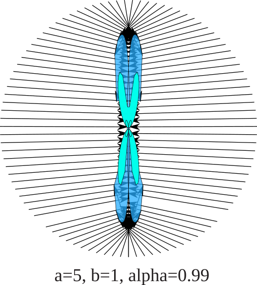

# Butterfly descent
Orest Dubay 2000 - 2023

## Introduction
I'd like to introduce a simple minimization algorithm that could be used
as an alternative to the steepest descent. I am not sure if this algorithm is already known.
Probably - but I don't know its name. Let's call it *Butterfly descent* - I'll explain later...
I did design the algorithm during my PhD study, played with it a bit
and then did not touch it for 20 years. Now I am bringing it back!

There are many well established algorithms
that are more tested and may eventually perform better.
There are excellent libraries with those algorithms. So why do you need *Butterfly descent*?
My unfound sale's pitch is: 

*Butterfly descent is (almost) as simple to implement as the steepest descent and (almost) as efficient as the 'really good' algorithms.*

So when would you use it? If you do not have a good library with optimization algorithms
or do not want to use it. When you hand-coded a fixed-step steepest descent and want something better.

This is the algorithm:

- Calculate the gradient: $\mathbf{g}_i$ at $\mathbf{x}_i$.

- Move a bit in the direction of the gradient: $\mathbf{x'}_i = \mathbf{x}_i + \varepsilon \mathbf{g}_i/|\mathbf{g}_i|$

- Calculate a new gradient: $\mathbf{g'}_i$ at $\mathbf{x'}_i$.

- **THE MAGIC HAPPENS HERE**: Estimate step size as $s_i = \alpha \varepsilon / |\mathbf{g'}_i - \mathbf{g}_i|$

- Move to a new position: $\mathbf{x}_{i+1} = \mathbf{x}_{i} - s_i \mathbf{g}_i$ 

That's it. If you are interested in the explanation how this algorithm works, keep reading...

## A bit of linear algebra for optimization algorithms

When discussing optimization algorithms, it is useful to consider a quadratic form
$$f(\mathbf{x}) = f_0 + \frac{1}{2} (\mathbf{x}-\mathbf{x_0})^T\mathbf{M}(\mathbf{x}-\mathbf{x_0}).$$
When matrix $\mathbf{M}$ is symetric and positive definite (i.e. all the eigenvalues are positive),
this formula describes a quadratic funcion with a single local minima at $\mathbf{x_0}$.
Without loss of generality we can neglect the constant term $f_0$, which does not effect the position
of the local minima - and we will omit it in the further.

Any smooth 2x differenciable function can be approximated by such a quadratic function
in the vicinity of its minima. This type of consideration forms a basis for the analysis of many
gradient-based minimization algorithms like steepest descent or quasi-Newton methods.

Matrix $\mathbf{M}$ is known as a Hessian matrix defined as a matrix of second derivatives:
$$\frac{\partial^2}{\partial_i\partial_j}f = \frac{1}{2} \left(\mathbf{e_i}^T\mathbf{M}\mathbf{e_j}+\mathbf{e_j}^T\mathbf{M}\mathbf{e_i}\right) = M_{ij}.$$
Thanks to the [spectral theorem](https://en.wikipedia.org/wiki/Spectral_theorem), we can use [eigenvalue devomposition](https://en.wikipedia.org/wiki/Eigendecomposition_of_a_matrix)
to express the function $f(\mathbf{x})$ in an orthonormal basis:
$$f(\mathbf{x}) = \frac{1}{2} (\mathbf{x}-\mathbf{x_0})^T\mathbf{O}^T\mathbf{\Lambda}\mathbf{O}(\mathbf{x}-\mathbf{x_0}),$$
where $\mathbf{O}$ is an orthogonal matrix with eigenvectors and $\mathbf{\Lambda}$ is the diagonal matrix of eigenvalues.
In a diagonal basis $\mathbf{q} = \mathbf{O}\mathbf{x}$ the quadratic form simplifies to
$$f(\mathbf{q}) = \frac{1}{2} (\mathbf{q}-\mathbf{q_0})^T\mathbf{\Lambda}(\mathbf{q}-\mathbf{q_0}).$$

In other words, we can rotate the coordinate system to such a orientation,
that is aligened with the main axes of the elipsoidal isosurface around a function extreme.

## On a plane

In two dimensions this would be simply 
$$f(x,y) = \frac{1}{2} (x-x_0, y-y_0)\left( \begin{array}{cc}a & 0\\ 0 &b\end{array}\right)\left(\begin{array}{c}x-x_0 \\ y-y_0\end{array}\right) = \frac{1}{2}[a(x-x_0)^2 + b(y-y_0)^2].$$
Let's assume that $a$ is much bigger than $b$. The iso-line $f(x,y)=h$ then is an elipsis
with main axes along the coordinate axis.
The function $f$ forms an elongated eliptical valley.
The Catch-22 of the steepest descent algorithm is,
how to decide on the step size in an elongated valey:

* If the step is too small, it takes too long to get to the bottom.
* If it is too big, algorithm "overshoots" far to the other side of the valey - so the step must be shorter than the "width" of the valey.
* But when the valey is narrow but long - then it takes many steps to walk to the bottom.

Mathematically the number of steps in the steepest descent is proportional to the ratio
of the highest and lovest eigenvalue of $\mathbf{\Lambda}$, which in our 2d case is $a/b$.
Better algorithms try to do ... better.

## Knowing the Hessian

What if you would know the gradient (which you know in the steepest descent algorithm),
but as well $a$ and $b$?
Since the gradient 
$$\nabla f = \left(\begin{array}{c}a(x-x_0) \\ b(y-y_0)\end{array}\right),$$
the function minimum is at
$$(x_0. y_0) = (x,y) - \left( \begin{array}{cc}1/a & 0\\ 0 &1/b\end{array}\right)
\left(\begin{array}{c}a(x-x_0) \\ b(y-y_0)\end{array}\right).$$
In general case
$$\nabla f = \mathbf{M}(\mathbf{x}-\mathbf{x_0})$$ and thus
we need an inverse of a Hessian matrix:
$$\mathbf{x_0} = \mathbf{x} - \mathbf{M}^{-1}\mathbf{M}(\mathbf{x}-\mathbf{x_0}) = \mathbf{x} - \mathbf{M}^{-1} \nabla f|_{\mathbf{x}}.$$
Which is the good old "Newton method". The only problem is, that we do not have the Hessian
and usually it is computationaly expensive to get it.

## Different algorithms, different tricks
* The trick of [quasi-Newton algorithms](https://en.wikipedia.org/wiki/Quasi-Newton_method) is to approximate the (inverse) Hessian - which is somewhat complicated.
* The trick of the steepest descent is to have the gradient step smaller than $1/a$,
where $a$ is the largest eigenvalue of $\mathbf{M}$ - but not much smaller.
How do you know the $a$? Hehe -  you don't. You just need to guess a small enough number.
* The trick of *butterfly descent* is to estimate $a$ and perform (sometimes almost) exactly $1/a$ step.
This eliminates one degree of freedom and it as well liberates you from the need to guess the correct step-size.
 
I'd say that the *butterfly descent* is the simplest form of a quasi-Newton algorithm
or a smarter automated steepest descent.

## How does it work?

Let's start with one little trick. We do not know the complete Hessian matrix $\mathbf{M}$,
but if we have some vector $\mathbf{v}$, can we find what is $\mathbf{M}\mathbf{v}$?
Let's do it like this:
$$\mathbf{M}\mathbf{v} = \mathbf{M}(\mathbf{x}-\mathbf{x_0} + \mathbf{v}) - \mathbf{M}(\mathbf{x}-\mathbf{x_0})$$
Now we can use the relation to the gradient $\nabla f(\mathbf{x}) = \mathbf{M}(\mathbf{x}-\mathbf{x_0})$:
$$\mathbf{M}\mathbf{v} = \nabla f(\mathbf{x} + \mathbf{v}) - \nabla f(\mathbf{x}).$$
Note that in a realistic situation we do not have a quadratic function, but a function that is only approximated by a quadratic function.
The further away we get from $x$, the more it can deviate. So it is better to stay close.
We can achieve that by multiplying vector $\mathbf{v}$ by some small number $\varepsilon$ - and later dividing it:

$$\mathbf{M}\mathbf{v} = \frac{1}{\varepsilon}\mathbf{M}\varepsilon\mathbf{v} = \frac{1}{\varepsilon}[\nabla f(\mathbf{x} + \varepsilon\mathbf{v}) - \nabla f(\mathbf{x})].$$
For $\varepsilon \to 0$ this is prety much a differenciation in the direction $\mathbf{v}$,
which is pretty much the same as $\mathbf{v} . \nabla$:
$$\mathbf{M}\mathbf{v} = (\mathbf{v} . \nabla) \nabla f.$$
So multiplication by Hessian is more or less a gradient calculation.

How do we use it to get $a$?
Let's look at it in 2d:
$$\mathbf{M}\left(\begin{array}{c}x \\ y\end{array}\right) = \left(\begin{array}{c}ax \\ by\end{array}\right)$$
$$\mathbf{M}\mathbf{M}\left(\begin{array}{c}x \\ y\end{array}\right) = \left(\begin{array}{c}a^2x \\ b^2y\end{array}\right)$$

The size of a 2d vector $\mathbf{v}=(v_x,v_y)$ is imply an Euclidean distance $|\mathbf{v}| = \sqrt{{v_x}^2+{v_y}^2}$.
Then
$$
\frac{|\mathbf{M}\mathbf{M}\mathbf{x}|}{|\mathbf{M}\mathbf{x}|}
= \frac{\sqrt{a^4x^2 + b^4y^2}}{\sqrt{a^2x^2 + b^2y^2}} = \frac{a^2\sqrt{x^2 + \frac{b^4}{a^4}y^2}}{a\sqrt{x^2 + \frac{b^2}{a^2}y^2}} = a \frac{\sqrt{x^2 + \frac{b^4}{a^4}y^2}}{\sqrt{x^2 + \frac{b^2}{a^2}y^2}}.$$

Consider two situations:

- When $a=b$ or if $y=0$, the result is exactly $a$.
- When $a$ is much greater than $b$, then $b/a$ is small and thus both the numerator and denominator are approximately |x| (for finite $|x|$) and thus the result is approximately $a$.
- When $x=0$, the x-axis is actually optimized - and the result is $b$ instead of $a$.

The last point is important - in ideal conditions algorithm should eliminate
all degrees of freedom one by one from the largest eigenvalue to the smalest.
As we will see in the last section, this is what gave the name to the algorithm.
 

Thus (in certain conditions)
$$a \approx \frac{|\mathbf{M}\mathbf{M}\mathbf{x}|}{|\mathbf{M}\mathbf{x}|}$$

Note that analogously we can justify the approximation of the largest Hessian eigenvalue in a general multi-dimensional case:
$$
\frac{|\mathbf{M}\mathbf{M}\mathbf{q}|}{|\mathbf{M}\mathbf{q}|}
=\frac{|\mathbf{O}^T\mathbf{\Lambda}^2\mathbf{O}\mathbf{q}|}{|\mathbf{O}^T\mathbf{\Lambda}\mathbf{O}\mathbf{q}|}
= \frac{\sqrt{\sum_i \lambda_i^4q_i^2}}{\sqrt{\sum_i \lambda_i^2q_i^2}} = 
 \lambda_{max} \frac{\sqrt{\sum_i \lambda_i^4/\lambda_{max}^4 q_i^2}}{\sqrt{\sum_i \lambda_i^2/\lambda_{max}^2q_i^2}}
\approx \lambda_{max}
.$$

Substituting $\mathbf{x} \to \mathbf{x} - \mathbf{x_0}$ we can write
$$a \approx \frac{|\mathbf{M}\mathbf{M}(\mathbf{x}-\mathbf{x_0})|}{|\mathbf{M}(\mathbf{x}-\mathbf{x_0})|}
= \frac{|\mathbf{M} \nabla f|}{|\nabla f|}
\approx \frac{1}{\varepsilon}\frac{|\nabla f(\mathbf{x} + \varepsilon\nabla f(\mathbf{x})) - \nabla f(\mathbf{x})|}{|\nabla f(\mathbf{x})|}
$$

Doing a substitution $\varepsilon \to \varepsilon/|\nabla f|$ will normalize the gradient step inside the numerical
differenciation and prevent issues with too small or too large steps:
$$a \approx 
\frac{1}{\varepsilon}
\left|\nabla f\left(\mathbf{x} + 
  \varepsilon\frac{\nabla f(\mathbf{x})}
  {|\nabla f(\mathbf{x})|}\right) - \nabla f(\mathbf{x})\right|
$$

This shows, that we can (in some cases) calculate an approximate value of the largest eigenvalue of the Hessian matrix
at a cost of a numerical differenciation of a gradient. This requires one extra step in the direction of the gradient.
The step must be small.
It does not matter how small as long as the machine precision will not become a problem in the numerical differenciation.

## The algorithm

The formulas sofar have been long, but the final algorithm is quite simple. 
One step of the *butterfly descent* algorithm can be described as follows:

- Calculate gradient: $\mathbf{g}_i$ at $\mathbf{x}_i$.

- Move a bit in the direction of the gradient: $\mathbf{x'}_i = \mathbf{x}_i + \varepsilon \mathbf{g}_i/|\mathbf{g}_i|$

- Calculate a new gradient: $\mathbf{g'}_i$ at $\mathbf{x'}_i$.

- Estimate step size: $s_i = \alpha \varepsilon / |\mathbf{g'}_i - \mathbf{g}_i|$

- Move to a new position: $\mathbf{x}_{i+1} = \mathbf{x}_{i} - s_i \mathbf{g}_i$ 

Algorithm has two hyperparameters: $\varepsilon$ and $\alpha$.

Parameter $\varepsilon$ controlls the step size in the numerical differenciation.
It simply should be as small as possible without causing issues with the
accuracy of the numerical differenciation. In most cases 1e-5 may be a good starting value.
However - if there is a lot of noise in the gradient calculation, a larger value should be considered.

Constant $\alpha$ is there for added safety. Normally it should be 1, then the algorithm should
progress as fast as it can. However, if there are issues with convergence,
$\alpha$ can be reduced to slow the algorithm down. This can make sense e.g. when
function $f$ is signifficantly non-quadratic or if it is not differenciable-without a smooth gradient.

Note that for functions without a smooth gradient (e.g. an absolute value or ReLu),
there could be situations when $\mathbf{g'}_i = \mathbf{g}_i$, thus the step $s_i$ would diverge.
In such a situation the algorithm could revert to a simple gradient descent.
This can be done e.g. by limiting the size of $s_i$.

Note that both hyperparameters are fairly agnostic to the nature of the function $f$.
This makes the algorithm very comfortable to use, without the need to tweak the hyperparameters.

## Extensions

*Butterfly descent* algorithm works like a simple steepest descent,
just with the dynamically calculated step size. That would allow to easily use all the tricks
that the steepest descent algorithms use: mixing, regularization, step limiting and so on.

A more interesting direction is to expand on the possibilities to calculate Hessian eigenvalues.
The current algorithm requires a positive definite Hessian.
However, with some tweaks it is possible to approximate eigenvalues with large negative eigenvalues.
This can be used to find not just minima, but as well saddle-points.
I have tried it and it works - but not extremely well. Saddle-point optimization is tricky...

There are probably some possibilities to improve on the numerical differenciation.
Since this is going in the direction of the gradient, it is effectively a steepest descent step too,
it is just not utilized. Maybe a more precise numerical differenciation schema could be designed.

## So why did I called it the 'butterfly descent' ?

As briefly discussed in the "How does it work?" section, the algorithm
tends to eliminate the degees of freedom quickly when $\mathbf{x}$ is in the direction
of an eigenvector - particularly when the eigenvector has a large eigenvalue.
But when the direction to the minimum is a combination of multiple eigenvectors,
the minimization can get slower.

This can be shown graphically on a plane:
Starting from a circle, we can see that after a single step (or after two steps),
the points may form butterfly-like shape, the points on the wings taking a longer time
to converge.
The most problematic points are actually the points close to an axis corresponding to
a smaller eigenvalue. (Close, but not close enough to converge quickly.)

Black arrows indicate the movement in the first iteration step.
Most arrow point to the Y axis, since the X-degree of freedom is practically
optimized after the first step - but not all points;
some more problematic points form the edge of the blue butterfly-like shape.
The edge of the light blue shape is formed by the points after the second
iteration.
