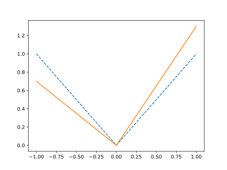
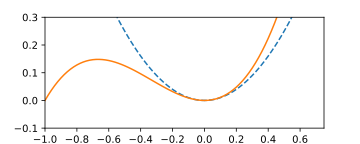
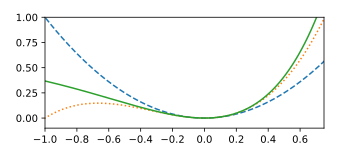
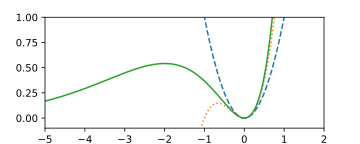

# Quantile Least Squares Regression Algorithms

## Introduction

When we do regression models, we usually have a some kind of a trend
that we want to capture with more or less sophisticated models.
Regression models typically try to capture a relation
$$y = f(\mathbf{x})$$
But what if we need something slightly different, for example
$$y \leq f(\mathbf{x}).$$
Then we can use [quantile regression](https://en.wikipedia.org/wiki/Quantile_regression).

I got recently interested in quantile regression
when working on a share-of-wallet model: Let's say you have data about customer purchases
for various types of customers. Customers may either be loyal to your shop
they may as well shop somewhere else. How much would a loyal customer spend?
Well ... more than a customer that is not loyal. This is a good case
for a quantile regression. 

I like linear models. When I explored the quantile linear models
I found that it is mostly using a quite natural, but not very imaginative loss function.
Most popular is a function that is like the absolute value (see [LAD](https://en.wikipedia.org/wiki/Least_absolute_deviations)), but one side
is steeper than the other.

Unlike least squares, neither the LAD nor typical quantile regression approaches have
an analytical solution. That bothered me and I've started to explore the problem.

## Linear least squares refresher

Let's start with plain linear least squares:
We have input features (independent variable) $X_{sp}$ and dependent variable $y_s$,
where $s$ index runs over samples and $p$ over the parameters.
Residuals measure the deviation of the actual observation $\y_s$ and
fit (regression-based prediction):
$$ \varepsilon_s = \sum_p X_{sp}a_p - y_s$$
Though this can be elegantly expressed in matrix form simply as
$\varepsilon = \mathbf{X}\mathbf{a} - \mathbf{y}$, in the implementation we might need the indices,
so I'll better write them down.

[Linear least squares](https://en.wikipedia.org/wiki/Linear_least_squares)
minimize the fitness function
$$ F = \sum_s \varepsilon_s^2$$
with respect to parameters $a_p$.
Note, that to get a weighed version, we just need to replace the sum with a weighted sum:
$\sum_s \bullet \to \sum_s w_s \bullet$.
This is achieved by solving a system of equations
$$\forall k: \frac{\partial}{\partial a_k}F=0$$
For the residual
$$\frac{\partial}{\partial a_k}\varepsilon_s = X_{sk},$$
then using the chain rule
$$ \frac{\partial}{\partial a_k} F = \sum_s 2\varepsilon_sX_{sk} $$
Thus we need to solve a system of linear equations with unknown parameters $a_k$:
$$\forall k: \sum_p a_p \underbrace{\sum_s X_{sp}X_{sk}}_{A_{pk}} - \underbrace{\sum_s X_{sk}y_s}_{b_k} = 0$$ 

(In weighted case $A_{pk} = \sum_s w_s X_{sp}X_{sk}$ and $b_k = \sum_s w_s X_{sk}y_{s}$.)

The solution can be written in matrix form:
$$\mathbf{a} = (\mathbf{X}^T\mathbf{X})^{-1}\mathbf{X}^T\mathbf{y} = \mathbf{A}^{-1}\mathbf{b}.$$

The nice think about linear least squares is, that it is a simple algebra
giving the result without any iterations.

## Analytical formula for quantile regression

The main trick of the quantile regression is that it is using an asymetric fitness function,
so that points above the regression function $f(\mathbf{X})$
are weighed more (or less) than the points below.
What we need is some simple asymetric function with the minimum at 0.

How about a cubic function $y=x^2(cx+1)$ - let's say with c=1:

Cubic function (orange) is quite close to a parabola $x^2$ (dashed blue line).
(Close zero, when $x^3 \ll x^2$ the $x^3$ can be neglected.)
Further away from zero the function becomes visibly asymetric - more shallow below and steeper above the zero.
This is pretty much the same trick as with the skewed absolute value.

Let's try to make a *"linear least cubes"* regression:

$$F = \sum_s \varepsilon_s^2(c\varepsilon_s + 1)$$

Let's try first to find the minimum for $k=1$:
$$
\frac{\partial}{\partial a}F
= \frac{\partial}{\partial a} \sum_s \varepsilon_s^2(c\varepsilon_s + 1) =
$$
$$
= \sum_s 2\varepsilon_sX_{s}(c\varepsilon_s + 1)+\varepsilon_s^2X_{s} =
$$
$$
= \sum_s (3c\varepsilon_s^2+2\varepsilon_s)X_{s}=
$$
$$
= \sum_s 3cX_s^3a^2 - 6cX_s^2y_sa + 3cX_sy_s^2 + 2X_s^2a-2X_sy_s =
$$
$$
= \left[3c\sum_s X_s^3\right]a^2 + \left[\sum_s 2X_s^2- 6cX_s^2y_s\right]a + \left[\sum_s3cX_sy_s^2 -2X_sy_s\right] = 0
$$
This is obviously a quadratic equation in $a$, which is easily solvable - and we can get an analytic solution again.
If you are wondering about two roots - the one that we want corresponds
to the local minimum of $F$, the other one corresponds to the local maximum.

To find the minimum in a general case, we need to find the partial derivatives after parameters $a_k$:
$$
\frac{\partial}{\partial a_k}F
= \frac{\partial}{\partial a_k} \sum_s \varepsilon_s^2(c\varepsilon_s + 1) =
\sum_s 2\varepsilon_sX_{sk}(c\varepsilon_s + 1)+\varepsilon_s^2X_{sk} = \sum_s (3c\varepsilon_s^2+2\varepsilon_s)X_{sk}
$$
Thus we need to solve
$$\sum_s (2+3c\varepsilon_s)\varepsilon_sX_{sk}=0.$$
For $c=0$ we get the simple linear least squares, but what makes the difference is
the term besides $c$:
$$
\sum_s \varepsilon_s^2X_{sk} = \sum_s \left(\sum_i X_{si}a_i - y_s\right)^2X_{sk}
$$
$$
= \sum_s \left(\sum_i X_{si}a_i - y_s\right)\left(\sum_j X_{sj}a_j - y_s\right)X_{sk}
$$
$$
= \sum_{sij} X_{si}X_{sj}X_{sk} a_i a_j - 2\sum_{si} X_{si}X_{sk}y_s a_i + \sum_{s} X_{sk}y_s^2
$$
As we can see, $\sum_s (3c\varepsilon_s^2+2\varepsilon_s)X_{sk}=0$ is a quadratic system
of $k$ equations with $k$ unknowns $a_k$.
This may be doable, but abit more complicated to solve...

## Exponencially weighted linear least squares

There is a more suitable and as well somewhat more intuitive choice of the
fitness function. As we mentioned earlier, the fit tends to go through the center
of a point cloud. But let's say we would like to go not through the center,
but rather through an "upper part" of the cloud (whatever it is).
We could simply do a classical regression and then make the regression again,
but only selecting the points above the first regression.
Or - we could use a weighted regression and put a larger weight on the points "above"
than on the points "below". (This is what quantile regression is doing via the asymetric fitness function.)
There are many choices how to do it.
The weights as a function of a residual $w(\varepsilon_s)$ should follow certain criteria though:

* Weight should be defined and positive for all residuals (negative weights are possiblem, but less intuitive).
* Weight should be a continuous function of a residual (othersise we get jumps in fitness function
and the problem might be difficult to solve numerically). 
* Weight should be a smoothly differenciable (e.g. to use the *butterfly descent* algorithm)
* Weight should be small and decreasing for negative residuals, large and increasing for positive residuals (or the other way round).

Cubic fitness from the previous section effectively has weights
$w_s^{\mathrm{cubic}} = c\varepsilon_s + 1$. Thus it may easily fail the first requirement,
unless parameter $c$ is tweaked so that all residulas are greater that $-1/c$.

The first function that comes to my ming as a good choice for a weight function
is ... an exponencial function.
The fithess function would look like
$$ F = \sum_s \exp(\gamma\varepsilon_s)\varepsilon_s^2$$

We can compare the exponencial function (for $\gamma=1$) to a quadratic and cubic function.
The exponencial function around zero is clearly asymetric, steeply growing on the right side
and more shallow on the left side. It beds down at some point,
but further away than the cubic function and it always stays positive!

Interestingly, we can create the fitness function by differenciation of a simple exponencial
$ E_s = \exp(\gamma \varepsilon_s)$. Since
$$\frac{\partial^2}{\partial \gamma^2} E_s = \frac{\partial^2}{\partial \gamma^2} \exp(\gamma \varepsilon_s),$$
$$F = \frac{\partial^2}{\partial \gamma^2} \sum_s E_s.$$
Thus 
$$\frac{\partial}{\partial a_k}F = \frac{\partial}{\partial a_k}\frac{\partial^2}{\partial \gamma^2} \sum_s E_s,$$
where the order of differenciations can be conviniently switched:
$$\frac{\partial}{\partial a_k}F = \sum_s \frac{\partial^2}{\partial \gamma^2}\frac{\partial}{\partial a_k} E_s$$
For $E_s$ we can derive that
$$\frac{\partial}{\partial \gamma}E_s = E_s \varepsilon_s,$$
$$\frac{\partial}{\partial \varepsilon_s}E_s = \gamma E_s,$$
and finally
$$\frac{\partial}{\partial a_k}E_s = \gamma E_sX_{sk}.$$
Thus
$$\frac{\partial}{\partial a_k}F = \sum_s \frac{\partial^2}{\partial \gamma^2}\frac{\partial}{\partial a_k} E_s =$$
$$= \sum_s \frac{\partial^2}{\partial \gamma^2}\gamma E_s X_{sk} =$$
$$= \sum_s \frac{\partial}{\partial \gamma}(E_s  + \gamma E_s \varepsilon_s)X_{sk} =$$
$$= \sum_s \frac{\partial}{\partial \gamma}(1  + \gamma \varepsilon_s)E_s X_{sk} =$$
$$= \sum_s \varepsilon_s E_s X_{sk} + (1  + \gamma \varepsilon_s)\varepsilon_s E_s X_{sk} =$$
$$= \sum_s (2  + \gamma \varepsilon_s)\varepsilon_s E_s X_{sk}.$$
Note that for $\gamma=0$ we get simply $\sum_s 2\varepsilon_s X_{sk}$, which is the ordinary linear least squares
gradient.

If we try to solve it analytically, it is difficult. For small $\gamma$ (i.e. linear approximation in terms of $\gamma$) we get
$$\sum_s (2  + \gamma \varepsilon_s)\varepsilon_s E_s X_{sk}
\approx \sum_s (2  + \gamma \varepsilon_s)(1  + \gamma \varepsilon_s)\varepsilon_sX_{sk}
\approx \sum_s (2  + 3\gamma \varepsilon_s)\varepsilon_sX_{sk}
$$
This is exactly the same problem as we tried to solve for the cubic fitness with $\gamma=c$.

We may not be able to solve the problem analytically,
but we know the analytical gradiend, so we can use the gradient descent - or better
the butterfly descent method to find optimal parameters.