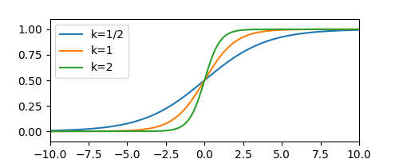

# Quantile Least Squares Regression Algorithms

## Introduction

When we do regression models, we usually have a some kind of a trend
that we want to capture with more or less sophisticated models.
Regression models typically try to capture a relation
$$y = f(\mathbf{x})$$
But what if we need something slightly different, for example
$$y \leq f(\mathbf{x}).$$

Then we can use [quantile regression](https://en.wikipedia.org/wiki/Quantile_regression).

I got recently interested in quantile regression
when working on a share-of-wallet model: Let's say you have data about customer purchases
for various types of customers. Customers may either be loyal to your shop
they may as well shop somewhere else. How much would a loyal customer spend?
Well ... more than a customer that is not loyal. This is a good case
for a quantile regression. 

I like linear models. When I explored the quantile linear models
I found that it is mostly using a quite natural, but not very imaginative loss function.
Most popular is a function that is like the absolute value (see [LAD](https://en.wikipedia.org/wiki/Least_absolute_deviations)), but one side
is steeper than the other.

Unlike least squares, neither the LAD nor typical quantile regression approaches have
an analytical solution. That bothered me and I've started to explore the problem.

## Linear least squares refresher

Let's start with plain linear least squares:
We have input features (independent variable) $X_{sp}$ and dependent variable $y_s$,
where $s$ index runs over samples and $p$ over the parameters.
Residuals measure the deviation of the actual observation $y_s$ and
fit (regression-based prediction):
$$ \varepsilon_s = \sum_p X_{sp}a_p - y_s$$
Though this can be elegantly expressed in matrix form simply as
$\varepsilon = \mathbf{X}\mathbf{a} - \mathbf{y}$, in the implementation we might need the indices,
so I'll better write them down.

[Linear least squares](https://en.wikipedia.org/wiki/Linear_least_squares)
minimize the fitness function
$$ F = \sum_s \varepsilon_s^2$$
with respect to parameters $a_p$.
Note, that to get a weighed version, we just need to replace the sum with a weighted sum:
$\sum_s \bullet \to \sum_s w_s \bullet$.
This is achieved by solving a system of equations
$$\forall k: \frac{\partial}{\partial a_k}F=0$$
For the residual
$$\frac{\partial}{\partial a_k}\varepsilon_s = X_{sk},$$
then using the chain rule
$$ \frac{\partial}{\partial a_k} F = \sum_s 2\varepsilon_sX_{sk} $$
Thus we need to solve a system of linear equations with unknown parameters $a_k$:
$$\forall k: \sum_p a_p \underbrace{\sum_s X_{sp}X_{sk}}_{A_{pk}} - \underbrace{\sum_s X_{sk}y_s}_{b_k} = 0$$ 

(In weighted case $A_{pk} = \sum_s w_s X_{sp}X_{sk}$ and $b_k = \sum_s w_s X_{sk}y_{s}$.)

The solution can be written in matrix form:
$$\mathbf{a} = (\mathbf{X}^T\mathbf{X})^{-1}\mathbf{X}^T\mathbf{y} = \mathbf{A}^{-1}\mathbf{b}.$$

The nice think about linear least squares is, that it is a simple algebra
giving the result without any iterations.

## Analytical regression formula with 1 parameter for an asymetric fitness function 

The main trick of the quantile regression is that it is using an asymmetric fitness function,
so that points above the regression function $f(\mathbf{X})$
are weighed more (or less) than the points below.
What we need is some simple asymmetric function with the minimum at 0.

How about a cubic function $y=x^2(cx+1)$ - let's say with c=1:

Cubic function (orange) is quite close to a parabola $x^2$ (dashed blue line).
(Close zero, when $x^3 \ll x^2$ the $x^3$ can be neglected.)
Further away from zero the function becomes visibly asymmetric - more shallow below and steeper above the zero.
This is pretty much the same trick as with the skewed absolute value.

Let's try to make a *"linear least cubes"* regression:

$$F = \sum_s \varepsilon_s^2(c\varepsilon_s + 1)$$

Let's try first to find the minimum for $k=1$:
$$
\frac{\partial}{\partial a}F
= \frac{\partial}{\partial a} \sum_s \varepsilon_s^2(c\varepsilon_s + 1) =
$$
$$
= \sum_s 2\varepsilon_sX_{s}(c\varepsilon_s + 1)+\varepsilon_s^2X_{s} =
$$
$$
= \sum_s (3c\varepsilon_s^2+2\varepsilon_s)X_{s}=
$$
$$
= \sum_s 3cX_s^3a^2 - 6cX_s^2y_sa + 3cX_sy_s^2 + 2X_s^2a-2X_sy_s =
$$
$$
= \left[3c\sum_s X_s^3\right]a^2 + \left[\sum_s 2X_s^2- 6cX_s^2y_s\right]a + \left[\sum_s3cX_sy_s^2 -2X_sy_s\right]
$$
$$
= \left[3c\sum_s X_s^3\right]a^2 + \left[\sum_s 2X_s^2(1 - 3cy_s)\right]a + \left[\sum_s X_sy_s(3cy_s -2)\right] = 0
$$
This is obviously a quadratic equation in $a$, which is easily solvable - and we can get an analytic solution
as for the linear least squares.
If you are wondering about two roots - the one that we want corresponds
to the local minimum of $F$ (that's the one we want), the other one corresponds to the local maximum.

Unfortunately this works only if the problem is one dimensional (i.e. if we only have a single feature).
The problem gets more complicated in the multidimensional case.

## Multidimensional case with a cubic fitness function 
To find the minimum in a general case, we need to find the partial derivatives after parameters $a_k$:
$$
\frac{\partial}{\partial a_k}F
= \frac{\partial}{\partial a_k} \sum_s \varepsilon_s^2(c\varepsilon_s + 1) =
\sum_s 2\varepsilon_sX_{sk}(c\varepsilon_s + 1)+\varepsilon_s^2X_{sk} = \sum_s (3c\varepsilon_s^2+2\varepsilon_s)X_{sk}
$$
Thus we need to solve
$$\sum_s (2+3c\varepsilon_s)\varepsilon_sX_{sk}=0.$$
For $c=0$ we get the simple linear least squares, but what makes the difference is
the term besides $c$:
$$
\sum_s \varepsilon_s^2X_{sk} = \sum_s \left(\sum_i X_{si}a_i - y_s\right)^2X_{sk}
$$
$$
= \sum_s \left(\sum_i X_{si}a_i - y_s\right)\left(\sum_j X_{sj}a_j - y_s\right)X_{sk}
$$

$$
= \sum_{sij} X_{si}X_{sj}X_{sk} a_i a_j - 2\sum_{si} X_{si}X_{sk}y_s a_i + \sum_{s} X_{sk}y_s^2
$$

The whole equation then turns to a system of non-linear equations
$$
\forall k: \sum_{ij} A_{ijk} a_i a_j + \sum_{i} B_{ik} a_i + C_k = 0,
$$
where
$$
A_{ijk} = 3c\sum_{s}X_{si}X_{sj}X_{sk}
$$
$$
B_{ik} =  \sum_{s}2X_{si}X_{sk}(1 - 3cy_s) 
$$
and
$$
C_{k} =  \sum_{s} X_{sk}y_s(3cy_s-2) 
$$
Solving this equation analytically might be complicated, but numerically it should be possible.
Numerical solution would be advantageous when the number of samples $s$ is much larger
than the number of parameters $p$, since it only requires to iterate over samples once
to create the tensors $A_{ijk}$, $B_{ik}$ and $C_{k}$.

## Minimization of the cubic fitness in a specific direction

Another option to benefit from the quadraticity of the problem is to
use it to solve minimization along the direction $v$ and intersecting a point $u$.  
In that case set $a_k \to \tilde{a_k} = u_k + \alpha v_k$, then the residual
$$
\varepsilon_s \to \tilde\varepsilon_s = \sum_i X_{si}(u_i+\alpha v_i) - y_s = \varepsilon_s^0 + \alpha \sum_s X_{si}v_i,
$$
where
$$ \varepsilon^0_s = \sum_i X_{si}u_i - y_s$$
is the residual at point $u$. The derivative after $\alpha$ is
$$
\frac{\partial}{\partial \alpha}\tilde\varepsilon_s = \sum_i X_{si}v_i
$$
Minimizing $F$ along $\tilde a$ requires
$$
0=\frac{\partial}{\partial \alpha}F = \frac{\partial}{\partial \alpha}\sum_s \tilde \varepsilon_s^2(c\tilde \varepsilon_s + 1)
= \sum_{si}(2+3c\tilde\varepsilon_s)\tilde\varepsilon_sX_{si}v_i
$$
Expanding this equation we get
$$
\sum_{si}(2+3c\tilde\varepsilon_s)\tilde\varepsilon_sX_{si}v_i = \sum_{sijk}[2+3c(X_{sj}v_j\alpha - y_s)](X_{sk}v_k\alpha - y_s)X_{si}v_i = 0
$$
Which is a quadratic equation
$$
A\alpha^2 + B\alpha + C = 0,
$$
where
$$A = 3c\sum_{sijk}X_{si}X_{sj}X_{sk}v_iv_jv_k$$
$$B = \sum_{sij}2X_{si}X_{sj}v_iv_j(1+3c \varepsilon^0_s)$$
$$C = \sum_{si}X_{si}v_i\varepsilon^0_s(2+3c\varepsilon^0_s)$$

For $u_k=0$ this leads to
$$A = 3c\sum_{sijk}X_{si}X_{sj}X_{sk}v_iv_jv_k$$
$$B = \sum_{sij}2X_{si}X_{sj}v_iv_j(1-3cy_s)$$
$$C = \sum_{si}X_{si}v_iy_s(3cy_s -2)$$

We can ask again the question which of the roots of this equation should we use.
The root should be the local minimum of $F$, i.e.
$$\frac{\partial^2}{\partial \alpha^2}F >0$$
$$\frac{\partial^2}{\partial \alpha^2}F = \frac{\partial}{\partial \alpha}(A\alpha^2 + B\alpha + C)=2A\alpha + B$$
Since
$$
\alpha_{1,2} = \frac{-B \pm \sqrt{B^2-4AC}}{2A},
$$
the second derivative is
$$
\frac{\partial^2}{\partial \alpha^2}F = \pm\sqrt{B^2-4AC}
$$
The second derivative is thus positive, if we take the root $\alpha_1$ with the
plus sign:
$$
\alpha = \frac{-B + \sqrt{B^2-4AC}}{2A}.
$$ 
One suitable special choice of the vector $\mathbf{v}$ is the gradient of $F$:
$$
v_k = \nabla_k F = \frac{\partial}{\partial a_k}F=2\sum_s \varepsilon_sX_{sk}=2\sum_{si}X_{si}X_{sk}a_i-y_sX_{sk}
$$
Finding $\alpha$ and minimizing $F$ in the direction of the gradient in an iterative scheme
would be equivalent to knowing a perfect step size in each step of a gradient descent.

Note, thant normally the gradient descent moves in the direction of the negative gradient.
Since we solve for $\alpha$, it does not matter what multiplication factor we chose for the gradient.
We may as well chose a (positive or negative) normalized gradient as $\mathbf{v}$. 

This could (in this special case) be an even faster alternative to the [butterfly descent](optimization.md).
Such an algorithm should in principle in each step eliminate roughly one degree of freedom,
thus it should converge in the number of iterations proportional to the number of features $p$.
(For a quadratic function we could get to the minimum in exactly to minimum in $p$ steps.
We are, however, minimizing a cubic, not a quadratic function.)  

## Exponencially weighted linear least squares

There is a more suitable and as well somewhat more intuitive choice of the
fitness function. As we mentioned earlier, the fit tends to go through the center
of a point cloud. But let's say we would like to go not through the center,
but rather through an "upper part" of the cloud (whatever it is).
We could simply do a classical regression and then make the regression again,
but only selecting the points above the first regression.
Or - we could use a weighted regression and put a larger weight on the points "above"
than on the points "below". (This is what quantile regression is doing via the asymmetric fitness function.)
There are many choices how to do it.
The weights as a function of a residual $w(\varepsilon_s)$ should follow certain criteria though:

* Weight should be defined and positive for all residuals (negative weights are possible, but less intuitive).
* Weight should be a continuous function of a residual (otherwise we get jumps in fitness function
and the problem might be difficult to solve numerically). 
* Weight should be a smoothly differentiable (e.g. to use the *butterfly descent* algorithm)
* Weight should be small and decreasing for negative residuals, large and increasing for positive residuals (or the other way round).

Cubic fitness from the previous section effectively has weights
$w_s^{\mathrm{cubic}} = c\varepsilon_s + 1$. Thus it may easily fail the first requirement,
unless parameter $c$ is tweaked so that all residuals are greater that $-1/c$.

The first function that comes to my mind as a good choice for a weight function
is ... an exponential function.
The fitness function would look like
$$F = \sum_s \exp(\gamma\varepsilon_s)\varepsilon_s^2$$

We can compare the exponential function (for $\gamma=1$) to a quadratic and cubic function.
The exponential function around zero is clearly asymmetric, steeply growing on the right side
and more shallow on the left side. It beds down at some point,
but further away than the cubic function and it always stays positive!

Interestingly, we can create the fitness function by differentiation of a simple exponencial
$E_s = \exp(\gamma \varepsilon_s)$. Since
$$\frac{\partial^2}{\partial \gamma^2} E_s = \frac{\partial^2}{\partial \gamma^2} \exp(\gamma \varepsilon_s) = E_s \varepsilon_s^2,$$
$$F = \frac{\partial^2}{\partial \gamma^2} \sum_s E_s = \sum_s E_s \varepsilon_s^2.$$
Thus 
$$\frac{\partial}{\partial a_k}F = \frac{\partial}{\partial a_k}\frac{\partial^2}{\partial \gamma^2} \sum_s E_s,$$
where the order of differenciations can be conviniently switched:
$$\frac{\partial}{\partial a_k}F = \sum_s \frac{\partial^2}{\partial \gamma^2}\frac{\partial}{\partial a_k} E_s$$
For $E_s$ we can derive that
$$\frac{\partial}{\partial \gamma}E_s = E_s \varepsilon_s,$$
$$\frac{\partial}{\partial \varepsilon_s}E_s = \gamma E_s,$$
and
$$\frac{\partial}{\partial a_k}E_s = \gamma E_sX_{sk}.$$
Thus
$$\frac{\partial}{\partial a_k}F = \sum_s \frac{\partial^2}{\partial \gamma^2}\frac{\partial}{\partial a_k} E_s =$$
$$= \sum_s \frac{\partial^2}{\partial \gamma^2}\gamma E_s X_{sk} =$$
$$= \sum_s \frac{\partial}{\partial \gamma}(E_s  + \gamma E_s \varepsilon_s)X_{sk} =$$
$$= \sum_s \frac{\partial}{\partial \gamma}(1  + \gamma \varepsilon_s)E_s X_{sk} =$$
$$= \sum_s \varepsilon_s E_s X_{sk} + (1  + \gamma \varepsilon_s)\varepsilon_s E_s X_{sk} =$$
$$= \sum_s (2  + \gamma \varepsilon_s)\varepsilon_s E_s X_{sk}.$$
Note that for $\gamma=0$ this reduces to $\sum_s 2\varepsilon_s X_{sk}$, which is the ordinary linear least squares
gradient.

It is impossible (or at least difficult) to solve the equation analytically. For small $|\gamma| \ll 1$ (i.e. linear approximation in terms of $\gamma$) we get
$$\sum_s (2  + \gamma \varepsilon_s)\varepsilon_s E_s X_{sk}
\approx \sum_s (2  + \gamma \varepsilon_s)(1  + \gamma \varepsilon_s)\varepsilon_sX_{sk}
\approx \sum_s (2  + 3\gamma \varepsilon_s)\varepsilon_sX_{sk}
$$
This is exactly the same problem as we tried to solve for the cubic fitness with $\gamma=c$.
In such a case we may accelerate the optimization by using the approaches described in previous sections
(i.e. numerical optimization of the nonlinear system or analytical minimization along the gradient).

Due to the nature of the approximation, this may work well for $|\gamma|\ll 1$,
but it will work less good for larger values. However, it may be suitable at the beginning of the iteration to get quickly closer
to a reasonable set of parameters even for larger $|\gamma|$.

For the final optimization we know the analytical gradient,
so we can use the gradient descent - or better
the *butterfly descent* method to find optimal parameters.

## Optimizing gamma

Partial derivative of $F$ after $\gamma$ leads to
$$\frac{\partial}{\partial \gamma}F = \frac{\partial^3}{\partial \gamma^3}\sum_s E_s(\gamma) = \sum_s \varepsilon_s^3\exp(\gamma \varepsilon_s)$$ 

Condition
$$\sum_s \varepsilon_s^3\exp(\gamma \varepsilon_s) = 0$$
effectively tries to find optimize $\gamma$ and thus the weights $\exp(\gamma \varepsilon_s)$
in such a way that would harmonize the cubes of residuals above and below zero.

This is similar to removing bias: Note that the least squares method does minimize the sum
of squares of residuals, but it does not provide any guarantees
regarding the bias.  The bias can be expressed as an average residual $(1/n)\sum_s\varepsilon_s$.
Minimizing the fitness function with respect to $\gamma$ will not minimize the residuals,
but rather the cube of residuals. This can be interpreted as finding weights,
that would balance out and thus reduce the bias stemming from the large residuals,
while the impact of small residual will be negligible or small. 

## Constrained quantile optimization

So far we have discussed shifting the fit of the linear regression by use
of an asymmetric fitness function.
Quantile regression algorithms normally offer an option
to specify the quantile.

For the *exponentially weighted linear least squares* this would probably
be possible by finding the specific value for parameter $\gamma$.
One way to achieve this would be a [bisection method](https://en.wikipedia.org/wiki/Bisection_method).
This, however, would have a drawback of using one numerical method inside of another.

Another possibility to find the specified quantile is 
the [constrained optimization](https://en.wikipedia.org/wiki/Constrained_optimization),
more specifically the [Lagrange multiplier](https://en.wikipedia.org/wiki/Lagrange_multiplier) method.

In constrained optimization we need to optimize a fitness function $F$ with
a constraint that a specified fraction of points will be above (or below) the fit -
in other words, that a specified fraction of residuals will be positive (or negative).
To solve this exactly, we could use a characteristic function
$$
\chi(x) = \left\{
\begin{array}{lr}
0&\ \forall x<0\\
1&\ \forall x\ge 0 
\end{array}\right.
$$
Then we could calculate the number of points above the fit as
$$
Q = \sum_s \chi(\varepsilon_s)
$$
and the quantile $q$ would be simply $Q$ divided by the total number of observations $n$.
For a weighted regression we could use
$$
q = \frac{\sum_s w_s\chi(\varepsilon_s)}{\sum_s w_s}
$$

The problem with the function $\chi$ is, that it is not smooth and differentiable in zero,
thus it is unsuitable for the Lagrange multiplier method.
We can, however approximate the characteristic function $\chi$ with another function.
There are many options to do that, one possibility would be the
[sigmoid function](https://en.wikipedia.org/wiki/Sigmoid_function):
$$
S(kx) = \frac{1}{1+e^{-kx}},
$$
where $k$ is a steepness parameter, as well known as the [logistic growth rate](https://en.wikipedia.org/wiki/Logistic_function).

Steepness $k$ controls the precision: the larger the $k$ is, the better approximation of the characteristic function we get.
The inverse steepness $1/k$ can be interpreted as a size of the transition between zero and one,
i.e. the size of a residual that is considered so close to the fit,
that it is not important whether it is above or below.

Using the sigmoid approximation, the quantile can be expressed as
$$
q \approx \frac{1}{n}\sum_s \frac{1}{1+e^{-k\varepsilon_s}}
$$
The constraint can be expressed as $C=0$ where
$$C=q-\frac{1}{n}\sum_s \frac{1}{1+e^{-k\varepsilon_s}}$$

Lagrange multiplier method then requires optimization of the Lagrangian function
$$
L(\mathbf{a},\gamma,\lambda) = F(\mathbf{a},\gamma) + \lambda C = F(\mathbf{a},\gamma) + \lambda\left(q-\frac{1}{n}\sum_s \frac{1}{1+e^{-k\varepsilon_s}} \right)
$$

The minimum with the constraint becomes the minimum of the Lagrangian function.
The minimum is reached when the gradient of the Lagrangian - i.e.
partial derivatives after all its parameters $a_i$, $\gamma$ and $\lambda$ becomes zero.

As before, we can use similar substitution of the exponential function:
$$E_s(\beta) = \exp(\beta\varepsilon_s)$$
$$\frac{\partial}{\partial a_p}E_s(\beta) = \beta X_{ps}\exp(\beta\varepsilon_s)=E_s(\beta) \beta X_{ps}$$
$$\frac{\partial}{\partial \beta}E_s(\beta) = \varepsilon_s\exp(\beta\varepsilon_s) = E_s(\beta)\varepsilon_s$$
$$\frac{\partial}{\partial \lambda}E_s(\beta) = 0$$

$$
L(\mathbf{a},\gamma,\lambda) = \frac{\partial^2}{\partial \gamma^2}\sum_s E_s(\gamma) + \lambda C
$$
Partial derivative of $L$ after $\lambda$ is simply the constraint:
$$\frac{\partial}{\partial \lambda}L = C = 0$$ 

Partial derivative of $L$ after $\gamma$ leads to
$$\frac{\partial}{\partial \gamma}L = \frac{\partial^3}{\partial \gamma^3}\sum_s E_s(\gamma) = \sum_s \varepsilon_s^3\exp(\gamma \varepsilon_s),$$ 
Which we discussed in the previous section.

Tha last part is the derivative of $L$ by $a_p$, which has two terms:
$$\frac{\partial}{\partial a_p}L = 
\frac{\partial^3}{\partial \gamma^2\partial a_p}\sum_s E_s(\gamma) + \lambda \frac{\partial}{\partial a_p}C 
$$
The first term we have solved earlier:
$$\frac{\partial^3}{\partial \gamma^2\partial a_p}\sum_s E_s(\gamma) = 
\sum_s (2  + \gamma \varepsilon_s)\varepsilon_s E_s(\gamma) X_{sp}.$$

Derivative of the constrain term $C$ by $a_p$ is  then
$$\frac{\partial}{\partial a_p}C =$$ 
$$=\frac{\partial}{\partial a_p}\left(q-\frac{1}{n}\sum_s \frac{1}{1+e^{-k\varepsilon_s}} \right) = $$ 
$$=\frac{\partial}{\partial a_p}\left(q-\frac{1}{n}\sum_s \frac{1}{1+E_s(-k)} \right) = $$ 
$$=\frac{1}{n}\sum_s \frac{-k X_{ps}E_s(-k)}{(1+E_s(-k))^2}$$

## Summary of algorithms
This section provides a summary of terms that need to be evaluated when implementing the above-mentioned
algorithms.

### Ordinary/weighted least squares
$$A_{pk} = \sum_s w_s X_{sp}X_{sk}$$
$$b_k = \sum_s w_s X_{sk}y_{s}$$
$$\mathbf{a} = (\mathbf{X}^T\mathbf{X})^{-1}\mathbf{X}^T\mathbf{y} = \mathbf{A}^{-1}\mathbf{b}.$$
$$a_p = \sum_i(\mathbf{A}^{-1})_{pi}b_i$$

### One-dimensional cubic fitness
$$
A = 3\gamma\sum_s w_s X_s^3
$$
$$
B = 2\sum_s w_sX_s^2(1 - 3\gamma y_s)
$$
$$
C = \sum_s w_sX_sy_s(3\gamma y_s -2)
$$
$$
a = \frac{-B + \sqrt{B^2-4AC}}{2A}.
$$ 
### Many-dimensional cubic fitness
Many-dimensional cubic fitness function can be optimized iteratively
updating the coefficients $a_k^n \to a_k^{n+1}$ by moving from position $u_k=a_k^n$ in the direction of the gradient
$$v_k^n = 2\sum_s w_s \varepsilon_s^nX_{sk},$$
where $\varepsilon^n_s$ is the residual for step $n$ and sample $s$:
$$\varepsilon^n_s = \sum_i X_{si}a_i^n - y_s$$
Coefficients of the quadratic equations are:
$$A^n = 3\gamma\sum_{sijk}w_sX_{si}X_{sj}X_{sk}v_i^nv_j^nv_k^n$$
$$B^n = 2\sum_{sij}w_sX_{si}X_{sj}v_i^nv_j^n(1+3\gamma \varepsilon^n_s)$$
$$C^n = \sum_{si}w_sX_{si}v_i^n\varepsilon^n_s(2+3\gamma\varepsilon^n_s)$$
$$
S^n = \frac{-B^n + \sqrt{(B^n)^2-4A^nC^n}}{2A^n}.
$$ 
$$a_k^{n+1} = a_k^{n} + S^n v_k^n$$

### Exponentially weighted linear least squares
Gradient for the exponentially weighted least squares fitness is
$$g_k^n = \sum_s w_s(2  + \gamma \varepsilon_s^n)\varepsilon_s^n \exp(\gamma \varepsilon_s^n) X_{sk}.$$
where $\varepsilon^n_s$ is the residual for step $n$ and sample $s$:
$$\varepsilon^n_s = \sum_i X_{si}a_i^n - y_s$$
Gradient in the direction of $\gamma$ (if relevant) is
$$g_{\gamma}^n = \sum_s w_s(\varepsilon_s^n)^3\exp(\gamma \varepsilon_s^n)$$

